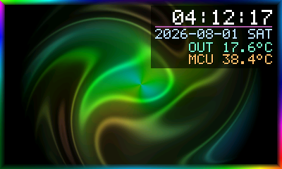

# pico-dvi-art-server

Infinite, never-repeating generative art streamed over Wi-Fi to a **Raspberry Pi Pico W**
driving a **Pico DVI LCD 10.1** (400x240 RGB565 framebuffer), with a live HUD and
GitHub OTA firmware updates.



* **Swirling vortex artwork** that never repeats - irrational frequency ratios plus a
  random per-run seed mean the pattern has no period.
* **Colour-swirling animated frame** around the edge with two counter-rotating comets.
* **HUD, top right:** clock, date underneath, then the **server** temperature
  (weather API or host CPU) and the **actual RP2040 chipset** temperature reported by
  the Pico itself.
* **Server issues everything** over Wi-Fi: pixels, and OTA "go update yourself" commands.
* **OTA over GitHub** with staged downloads, automatic rollback and a blocked-version
  guard so a bad push can never brick the display.
* Optional **AI image mode** (rotating prompt template -> image API -> 400x240 RGB565).

---

## Run it — one file, no questions

Double-click **`START.bat`**. That is the whole procedure.

It finds Python (installing nothing you already have), installs the dependencies the
first time, launches a background USB watcher, and starts streaming. There are no
menus, no port numbers to type and no options to pick. Close the window to stop it.

```
START.bat
  ├── finds Python 3.9+ (PATH, py launcher, or %LOCALAPPDATA%\Programs\Python)
  ├── pip install -r pc_server/requirements.txt mpremote pyserial   (first run only)
  ├── tools/flash_pico.py --auto --watch 30   ← background, provisions any Pico
  └── pc_server/server.py                     ← streams art, auto-restarts on crash
```

The watcher rescans USB every 30 seconds, so you can plug the Pico in at any time —
before or after starting — and it gets set up on its own.

### What the auto-provisioner does to a board

| Board state                        | Action                                                    |
| ---------------------------------- | --------------------------------------------------------- |
| BOOTSEL (`RPI-RP2` drive)          | downloads the latest MicroPython `.uf2`, installs it, then copies the firmware |
| MicroPython, wrong/no firmware     | copies the firmware and resets the board                   |
| MicroPython, firmware already current | left alone                                              |
| **Any other firmware**             | **never touched** — flashing would erase it permanently    |

That last row is deliberate. If your display board is currently running its own
firmware, put it in BOOTSEL mode first: unplug it, hold the **BOOTSEL** button, plug it
back in, release. An `RPI-RP2` drive appears and the installer takes over by itself.

Wi-Fi credentials and the server address live in `pico_firmware/device_secrets.py`,
which is git-ignored and never uploaded. The provisioner creates it on the first run
(from the `PICO_WIFI_SSID` / `PICO_WIFI_PASS` environment variables when running
unattended) and keeps `SERVER_IP` pointing at this PC's current LAN address.

Advanced use, if you ever want it:

```
python tools/flash_pico.py --list      # identify every connected board, change nothing
python tools/flash_pico.py             # interactive setup, prompts for credentials
python tools/flash_pico.py --dry-run   # show the plan
```

---

## Architecture

```
[ PC / local server ]  pc_server/server.py
   |  1. InfiniteArtEngine        - swirling plasma, no repeat period
   |  2. SwirlBorder              - animated colour frame
   |  3. HUD                      - clock / date / OUT temp / MCU temp
   |  4. RGB565 pack (192,000 B)
   +--> TCP :5001 --- Wi-Fi ---> [ Pico W ]  pico_firmware/main.py
                                     |  blits bytes into the DVI framebuffer
                                     |  sends TEMP / STAT / HELLO back up
                                     v
                            [ Pico DVI LCD 10.1 ]

[ GitHub repo ] --raw version.json + *.py--> [ Pico W boot.py ] --flash--> reboot
```

### Wire protocol

Server to Pico, little-endian:

| Packet  | Bytes                                                         |
| ------- | ------------------------------------------------------------- |
| Frame   | `AA BB CC DD` + `uint32 length` + `length` bytes RGB565        |
| Command | `AA BB CC EE` + `uint32 length` + UTF-8 JSON `{"cmd": "ota"}`  |

Pico to server, newline-terminated ASCII:

```
HELLO <fw_version> <device_id>
TEMP <celsius>            # RP2040 on-chip sensor -> the "MCU" HUD line
STAT fps=<f> drops=<n>
```

---

## Cycle times — what changes, and how fast

Nothing in the visual layer ever repeats: every animated term uses a mutually
irrational frequency (φ, √2, √3, √5, √7), so the combined signal has **no finite
period**. The numbers below are the *perceived* rhythms, not loop lengths.

| Layer | Cycle | Where to change it |
| --- | --- | --- |
| Frame refresh | **20 fps** (50 ms) | `fps` / `--fps` (server renders up to ~41 fps) |
| Vortex swirl rotation | ~18 s per turn | `t * 0.35` in `math_shaders.render` |
| Full hue wheel (whole artwork) | **~28 s** | `t * 0.021 * PHI` |
| Plasma band motion | 7–12 s | `f1`…`f4` frequencies |
| Swirl strength breathing | ~57 s | `_drift(t, 0, 0.11)` |
| Zoom breathing | ~90 s | `_drift(t, 1, 0.07)` |
| Border hue wheel | ~8.3 s | `t * 0.12` in `SwirlBorder.apply` |
| Border comet lap | ~4.5 s / ~7.7 s (counter-rotating) | `t * 0.22`, `t * 0.13` |
| Clock digits | 1 s | `show_seconds` |
| MCU temperature uplink | **5 s** | `TELEMETRY_INTERVAL_S` |
| Server temperature refresh | **10 min** | `temp_refresh_s` |
| New AI image (when enabled) | **90 s**, 3 s cross-fade | `ai_interval_s`, `ai_fade_s` |
| OTA check | **on boot + hourly** | `OTA_ON_BOOT`, `OTA_CHECK_MINUTES` |
| OTA on demand | ~2 s to reach the board (+ up to 5 min GitHub CDN lag) | `python pc_server/push_ota.py` |
| Reconnect after server loss | 3 s, infinite retry | `RECONNECT_DELAY_S` |

Because the drift terms are incommensurable, the *combination* of swirl angle, zoom,
hue and plasma phase only approximately recurs on a timescale of years — and the
random per-boot seed shifts all of them anyway, so restarting the server gives you a
genuinely different piece.

Want it calmer or wilder? `--speed 0.4` slows every visual cycle by 2.5x,
`--speed 2.0` doubles them; the clock and temperatures are unaffected.

---

## Repository layout

```
pico-dvi-art-server/
├── START.bat                # ← the only file you run. Everything else is internal.
├── .github/workflows/
│   ├── release.yml          # auto-increments pico_firmware/version.json on push
│   └── ci.yml               # tests + firmware byte-compile
├── pico_firmware/           # flashed onto the Pico W
│   ├── boot.py              # rollback check -> Wi-Fi -> GitHub OTA
│   ├── ota.py               # GitHub updater with staging + rollback
│   ├── main.py              # stream receiver, telemetry, offline fallback
│   ├── display_driver.py    # panel backends + offline animation
│   ├── config.py            # tuning values (safe to publish)
│   ├── device_secrets.example.py  # template -> copy to device_secrets.py
│   └── version.json         # firmware version + file manifest
├── pc_server/               # runs on your PC / home server
│   ├── server.py            # TCP server + stream orchestrator
│   ├── math_shaders.py      # infinite swirl engine + swirling border
│   ├── hud.py               # clock / date / temperature overlay
│   ├── font5x7.py           # bitmap font
│   ├── temperature.py       # weather / CPU / static temperature source
│   ├── pixels.py            # RGB888 <-> RGB565 + framing
│   ├── ai_prompts.py        # rotating AI prompt template + image fetcher
│   ├── preview.py           # render PNGs without hardware
│   ├── fake_pico.py         # virtual Pico W for end-to-end testing
│   ├── push_ota.py          # tell every connected board to update now
│   ├── config.example.json  # copy to config.json and edit
│   └── requirements.txt
├── tools/
│   └── flash_pico.py        # USB detection + MicroPython install + provisioning
└── tests/
    ├── test_pipeline.py      # font, packing, shaders, HUD, socket round-trip
    └── test_ota.py           # OTA staging / rollback against a stubbed GitHub
```

---

## 1. Run the server

`START.bat` already does all of this. The commands below are the manual equivalent.

```powershell
pip install -r pc_server/requirements.txt

# check the artwork without any hardware -> preview/frame_XXX.png
python pc_server/preview.py --frames 6

# start streaming
python pc_server/server.py
```

The server prints its LAN addresses on start - put that IP into
`pico_firmware/config.py` as `SERVER_IP`.

Useful flags: `--fps 25`, `--source hybrid`, `--speed 0.6`, `--border 12`,
`--byte-order big`, `--temp-source cpu`, `--no-hud`, `--self-test 60`.

Configuration precedence: defaults -> `pc_server/config.json`
(copy `config.example.json`) -> `PICOART_*` environment variables -> CLI flags.

```powershell
copy pc_server\config.example.json pc_server\config.json
$env:PICOART_FPS = "25"        # env override example
```

### Verify without hardware

```powershell
python pc_server/server.py --port 5099          # terminal 1
python pc_server/fake_pico.py --port 5099 --frames 60 --save shot.png   # terminal 2
```

`fake_pico.py` speaks the real protocol, reports a fake MCU temperature and writes the
frame it received to PNG - what you see there is exactly what the panel shows.

---

## 2. Flash the Pico W (automatic)

`START.bat` does this for you — see [Run it](#run-it--one-file-no-questions) above.
The manual route below is only for when you want to do it by hand.

1. Install MicroPython for the Pico W, then create your credentials file:

   ```powershell
   copy pico_firmware\device_secrets.example.py pico_firmware\device_secrets.py
   ```

   Edit it with your `WIFI_SSID`, `WIFI_PASS`, `SERVER_IP` and `GITHUB_*` values.
   **It is git-ignored** — this repo has to be public for raw OTA to work, so the
   password must never be committed. `config.py` reads it and falls back to harmless
   placeholders when it is absent.
2. Copy `boot.py`, `main.py`, `ota.py`, `display_driver.py`, `config.py`,
   `device_secrets.py` and `version.json` to the board (Thonny, or
   `mpremote cp pico_firmware/*.py :` — skip the `.example` file).
3. Power the board from any USB adapter next to the panel.

On boot it joins Wi-Fi, checks GitHub for a newer firmware version, then connects to
the server and starts blitting frames. If the server is down it shows a local fallback
animation and keeps retrying, so the panel is never blank.

### Display backends

`display_driver.py` probes, in order: a `picodvi.DVI` MicroPython module, a
CircuitPython `picodvi.Framebuffer` + `framebufferio` combination, and finally a
headless stub so you can validate the network path before the panel library is
sorted. To use a different library, add a class exposing `buffer`, `show()` and
`name` to `_BACKENDS`.

If red and blue look swapped, flip the byte order on the server:
`python pc_server/server.py --byte-order big`.

---

## 3. OTA updates over GitHub

1. Push this repo to GitHub (public, or the raw URLs will 404 — which is exactly why
   `device_secrets.py` is git-ignored).
2. Set `GITHUB_USER` / `GITHUB_REPO` / `GITHUB_BRANCH` in
   `pico_firmware/device_secrets.py`.
3. Edit any firmware file and push. `release.yml` bumps `version.json` and rewrites its
   file manifest automatically.
4. The board updates on its next boot, on its scheduled check
   (`OTA_CHECK_MINUTES`, default hourly), or immediately when you run:

```powershell
python pc_server/push_ota.py                  # {"cmd": "ota"}
python pc_server/push_ota.py --reboot         # {"cmd": "reboot"}
```

The running server picks the trigger file up within 2 seconds and broadcasts the
command to every connected board.

**Propagation delay.** `raw.githubusercontent.com` is fronted by a CDN with a hard
`max-age=300`, so a freshly pushed commit takes **up to 5 minutes** to become visible
to the board — no client-side header can bypass it. If you push and immediately run
`push_ota.py`, the device may still see the old version; it will pick the new one up
on its next hourly check, or just wait five minutes and trigger again.

**Safety net.** Files are downloaded to `<name>.new` and validated (non-empty, not a
GitHub 404 page) before anything is replaced. The version is then re-checked, so a
publish landing mid-download can never mix old and new files. The old copies are kept
as `<name>.bak` and an `ota.pending` marker is written. `main.py` calls
`ota.mark_boot_ok()` after 20 successfully streamed frames, which clears the marker.
If the board never gets that far, the next boot restores the backups, marks the bad
version as `blocked` and refuses to install it again — push a higher version to
recover.

`config.py` and `device_secrets.py` are deliberately excluded from the manifest, so
OTA never overwrites your Wi-Fi credentials.

---

## 4. AI image mode (optional)

`ai_prompts.py` holds the master prompt template plus the rotating variable lists
(subject / style / palette / seed), so no two generations are alike:

```powershell
python pc_server/ai_prompts.py      # print a few sample prompts
```

To stream generated images instead of (or blended with) the shader:

```powershell
pip install pillow
$env:OPENAI_API_KEY = "sk-..."
python pc_server/server.py --source ai        # or: --source hybrid
```

`source=ai` cross-fades to each new image, `source=hybrid` keeps the swirl engine
breathing over it. Generation happens on a background thread - a failed or slow API
call never stalls the stream, the shader simply keeps running. Set
`"ai_provider": "folder"` in `config.json` to cycle through local images in
`art_cache/` instead of calling an API.

**Never commit API keys** - they are read from the environment variable named by
`ai_api_key_env`.

---

## 5. Temperatures

| HUD line | Source                                                                        |
| -------- | ----------------------------------------------------------------------------- |
| `OUT`    | server side: Open-Meteo current temperature (default), host CPU, or a constant |
| `MCU`    | the Pico's own RP2040 on-chip sensor (ADC4), sent up the stream every 5 s      |

```json
{ "temp_source": "weather", "latitude": 51.2194, "longitude": 4.4025 }
```

`temp_source` accepts `weather`, `cpu` (needs `pip install psutil`), `static` or
`none`. Labels are configurable via `temp_label_server` / `temp_label_local`.
`--` is shown until the first reading arrives, so a dead network never blanks the HUD.

---

## Tests

```powershell
python -m unittest discover -s tests -v
python pc_server/server.py --self-test 60
```

28 tests cover the font metrics, RGB565 packing in both byte orders, shader
determinism and non-repetition, the border geometry, HUD placement, config coercion,
prompt rotation, and a full socket round-trip including telemetry.

A further 10 tests run the firmware's OTA module on desktop Python with `machine`,
`urequests` and `config` stubbed, proving that a failed download, an HTML 404 page or
a firmware that never boots all leave the device on its previous working version.

---

## Performance notes

* Rendering costs ~25 ms/frame at 400x240 on a modern desktop CPU (~40 fps headroom);
  the border precomputes its geometry once and only touches edge pixels.
* Each frame is 192,000 bytes. At 20 fps that is ~31 Mbit/s - fine over 2.4 GHz
  Wi-Fi on a quiet network, but the Pico W's CYW43439 is the real limit; drop `--fps`
  if you see stutter.
* TCP back-pressure paces the stream automatically: a slow board simply receives
  fewer frames instead of desynchronising.
